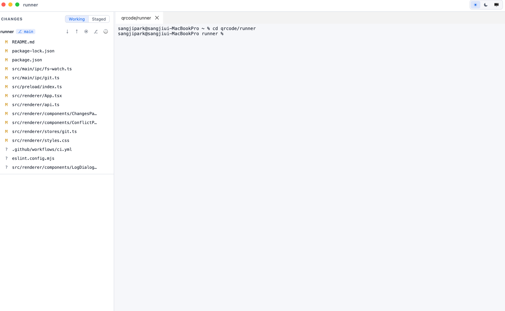
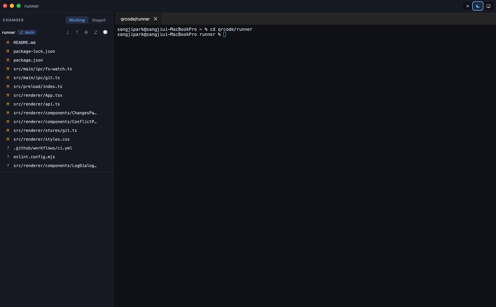
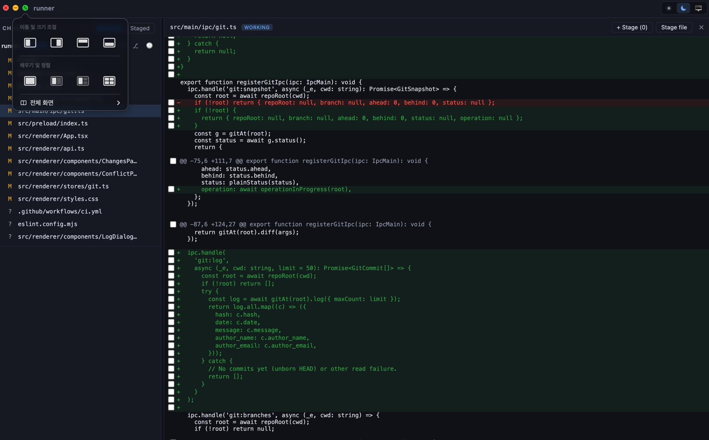

# Runner

> A Claude Code workbench — multiple terminals and git in a single window.

Runner is an Electron-based workbench for managing several terminal sessions
and git operations in one desktop app. Terminal sessions are owned by a
background daemon that lives independently of the window, so your shells stay
alive even after you close and reopen the window.



## Features

- **Multiple terminals** — split/tab layouts with automatic working-directory (cwd) tracking
- **Persistent sessions** — terminal PTYs are owned by the daemon and restored across app restarts
- **Per-directory git** — git repositories backing open terminals are grouped by directory in the Changes panel
- **Changes / diff** — per-file diff view, line-level staging, and Pull / Push / Commit / Branch / Discard / History
- **Conflict resolution** — merge/rebase progress indicator with Continue / Abort
- **Terminal search** — incremental find-in-terminal (⌘F) over the scrollback
- **Auto-update** — checks GitHub Releases on launch and offers the new build (notify-style, no signing required)
- **Themes** — light / dark / system

### Light and dark themes

The theme switch in the top-right toggles light, dark, and system modes. The
selected mode is persisted; system mode follows the OS setting.



### Inline diffs with line-level staging

Click a changed file to open its diff over the terminal area. Stage individual
hunks or lines, or stage the whole file at once.



## Architecture

```
src/
├── daemon/    # Background process that owns the PTYs (unix-socket RPC)
├── main/      # Electron main — IPC hub, daemon supervisor, update check
├── preload/   # contextBridge security boundary
├── renderer/  # React UI (zustand, dockview, xterm)
└── shared/    # Protocol types / paths
scripts/       # Icon generator (pixel-art runner sprite → build/icon.icns)
build/         # electron-builder resources (generated app icon)
```

## Develop / run

```bash
npm install
npm run dev        # development mode (electron-vite)
npm run build      # production build
npm run typecheck  # type check
npm run lint       # ESLint
npm run test       # unit tests (vitest)
npm run gen:icon   # regenerate the app icon from the pixel sprite
npm run package    # package the app
```

## Install as a Mac app & updates

Build a local `.app` / `.dmg`:

```bash
npm run package:mac   # writes release/*.dmg + release/mac-*/Runner.app
```

Drag `Runner.app` into `/Applications`. The app icon is a pixel-art runner
generated from `scripts/runner-sprite.mjs` (run `npm run gen:icon` after editing
the sprite — it rewrites `build/icon.icns` and the welcome-screen sprite).

### Shipping an update

Releases are automated. Cut one with:

```bash
npm run release       # npm version patch → tags vX.Y.Z → pushes the tag
```

Pushing a `v*` tag triggers `.github/workflows/release.yml`, which builds an
unsigned macOS DMG/zip and attaches it to a GitHub Release. On launch the app
checks the latest release and, if it's newer, shows a **Download** toast (also
available any time via the command palette → *Check for Updates*). Updates are
notify-only — no Apple Developer certificate required; users drag-install the
new DMG. Develop freely with Claude Code; `npm run release` is the whole ship
step.

## Keyboard shortcuts

| Key | Action |
|-----|--------|
| ⌘T | New terminal |
| ⌘D / ⌘⇧D | Split right / down |
| ⌘W | Close current terminal |
| ⌘B | Toggle Changes panel |
| ⌘F | Find in terminal |
| ⌘K | Command palette |
